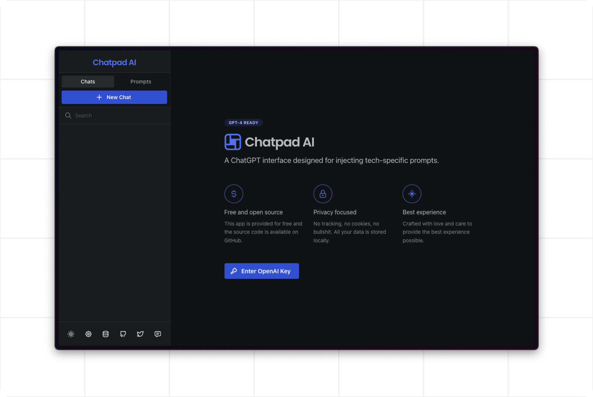

<h1>Chatpad AI</h1>

<h2>ChatGPT UI with Prompt Injections</h2>

<a href="https://chatpad.dev"> Visit Web App</a>

Expanding on [deiucanta](https://github.com/deiucanta)'s open-source interface, this modified version is tailored for technology-specific prompt injections, making it an ideal tool for designers, developers, data scientists and more.

### ⚡️ Free and open source

This app is provided for free and the source code is available on GitHub.

### 🔒 Privacy focused

No tracking, no cookies, no bullshit. All your data is stored locally.

### ✨ Best experience

Crafted with love and care to provide the best experience possible.

---

## 1-Click Deployments

<!-- Vercel -->

<!-- Railway -->

## Give Feedback

If you have any feedback, feature requests or bug reports, message [feedback@chatpad.dev](mailto:feedback@chatpad.dev).

## Contribute

This is a React.js application. Clone the project, run `npm i` and `npm start` and you're good to go.

## Credits

- [Andrei Canta](https://github.com/deiucanta) - The original creator of this awesome project
- [DexieJS](https://dexie.org) - A Minimalistic Wrapper for IndexedDB
- [Mantine](https://mantine.dev) - A fully featured React component library
